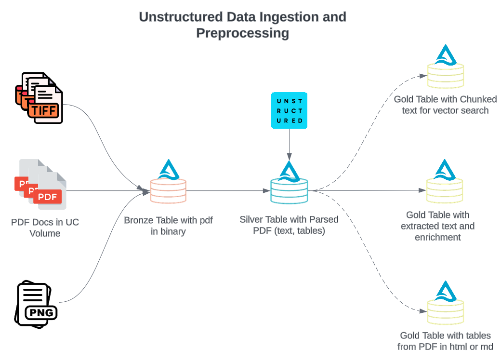

# Data Ingestion 

## Introduction

This series of notebooks, we shows how to ingest semi-unstructured and structured documents with Databricks Medallion architecture. For unstructured data (pdfs, images, etc), we currently leverage Unstructred OSS API to perform OCR, partition, and extract components (see architecture diagram below)

  

## Templates

* [Ingest JSON files DLT Python](./DLT-Transcript-Policy-Ingestion-Python.py)
* [Ingest JSON files DLT SQL](./DLT-Transcript-Policy-Ingestion-SQL.sql)
* [Ingest PDF files with tables](./PDF-Text-Table-Ingestion.py)
* [Ingest Image files with text for NER](./Image-Text-Ingestion.py)

## Setup Environment

* Use the notebook **`config`** to define the name of your preferred catalog, schema, and volume
* Run notebook **`00-setup`** to create a catalog, schema, volume, and download dataset to the volume