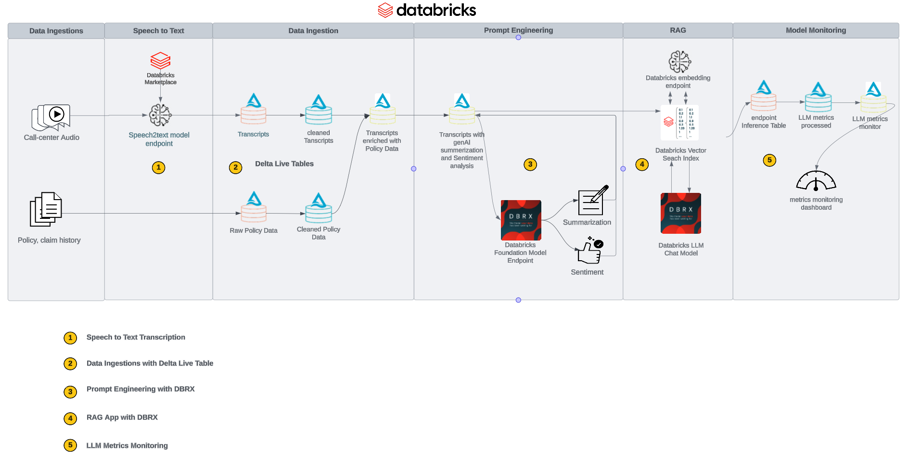
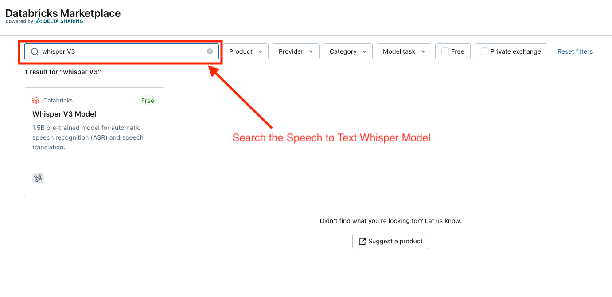

# Application: Extract Intelligence from raw call center transcripts using RAG

## Architecture

## Please Follow the Steps Below:

### Introduction and Setup Environment

* Use the notebook **`config`** to define the name of your preferred catalog, schema, and volume
* Then review notebook **`Introduction`** for an overview of the current PoC Template
* Run notebook **`00-setup`** to create a catalog, schema, volume, and download dataset to the volume

### Step 1. Raw Audio Ingestions with AutoLoader and Perform Speech to Text Transcription in Batch

* Run notebook **`01-speech2text-transcription`**
* Ingest `.wav` file with AutoLoader to a Delta lake table
* Download and register the speech to text `whisper-v3-large` model to a unity catalog. Please refer to the below image for steps

  * Go to databricks marketplace
  
  * Search for "Whisper V3 Large" model
  
  * Click "Instance Access" Button at the top right
  
  * Enter desired unity catalog location
  

* Perform batch inference to transcribe audio to text and save to `.json` in a unity catalog volume location

### Step 2. Data Ingestions and transformation with Delta Live Table

* Create a Delta Live Table Pipeline using notebook **`02-DLT-Transcript-Policy`**, refer to the below imange for the example of the resulting pipeline. Please also refer to the [DLT pipeline tutorial](https://learn.microsoft.com/en-us/azure/databricks/delta-live-tables/tutorial-pipelines) on how to set up a DLT pipeline
  
* Run notebook **`02.1-DLT-Transcript-Enriched-Persist-MV`** to create a copy of materialized view of the DLT from the previous step. This steps is needed to due the current [limitation](../../README.md#limitations) of DLT table

### Step 3. Prompte Engineering with Databricks DBRX Fundation LLM

* Run notebook **`03-Prompt-Engineering`** to perform summarization and sentiment analysis task using prompt enginering in batch with the Databricks DBRX foundation model

### Step 4. RAG Chatbot with Databricks DBRX Fundation LLM

* Run notebook **`04-Knowledge-Chatbot-RAG`** to create a vector search index using the result delta table of the previous notebook **`03-Prompt-Engineerin`**, we then build a RAG Chatbot with the Databricks DBRX foundation model using the vector search index as context. Lastly, we deploy the chat model to Databricks Model Serving Endpoint
* Enable inference table for the RAG Chatbot model so we can monitor the model metrics

### Step 5. RAG Chatbot with Databricks DBRX Fundation LLM

* Run notebook **`05-Inference-Table-Monitoring-LLM-Metrics`** for process and calculate LLM metrics and enable lakehouse monitoring to create a dashboard for tracking the LLM metrics