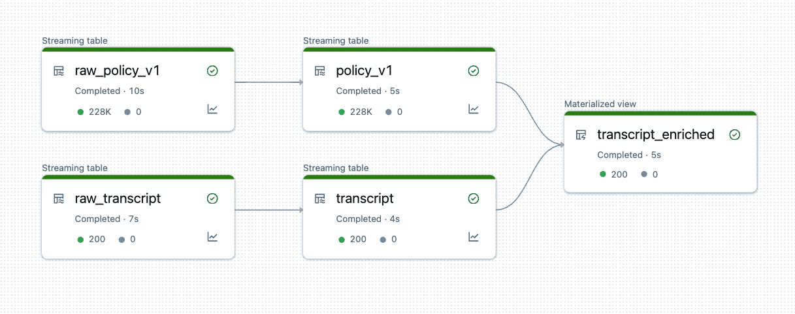

# Application. [Extract Intelligence from raw call center transcripts using RAG](./transcripts_summarization_rag_chatbot/)

## Architecture

## Please Follow the Steps Below:

### Introduction and Setup Environment

  * Start with notebook **`Introduction`** for an overview of the PoC Template
  * Run notebook **`00-setup`** to create a catalog, schema, volume, and download dataset to the volume

### Step 1. Data Ingestions with Delta Live Table

  * Create a Delta Live Table Pipeline using notebook **`01-DLT-Transcript-Policy`**, refer to the below imange for the example of the resulting pipeline. Please also refer to the [DLT pipeline tutorial](https://learn.microsoft.com/en-us/azure/databricks/delta-live-tables/tutorial-pipelines) on how to set up a DLT pipeline
  
  * Run notebook **`01.1-DLT-Transcript-Enriched-Persist-MV`** to create a copy of materialized view of the DLT from the previous step. This steps is needed to due the current [limitation](../../README.md#limitations) of DLT table

### Step 2. Prompte Engineering with Databricks DBRX Fundation LLM

* Run notebook **`02-Prompt-Engineering`** to perform summarization and sentiment analysis task using prompt enginering in batch with the Databricks DBRX foundation model

### Step 3. RAG Chatbot with Databricks DBRX Fundation LLM

* Run notebook **`03-Knowledge-Chatbot-RAG`** to create a vector search index using the result delta table of the previous notebook **`02-Prompt-Engineerin`**, we then build a RAG Chatbot with the Databricks DBRX foundation model using the vector search index as context. Lastly, we deploy the chat model to Databricks Model Serving Endpoint
